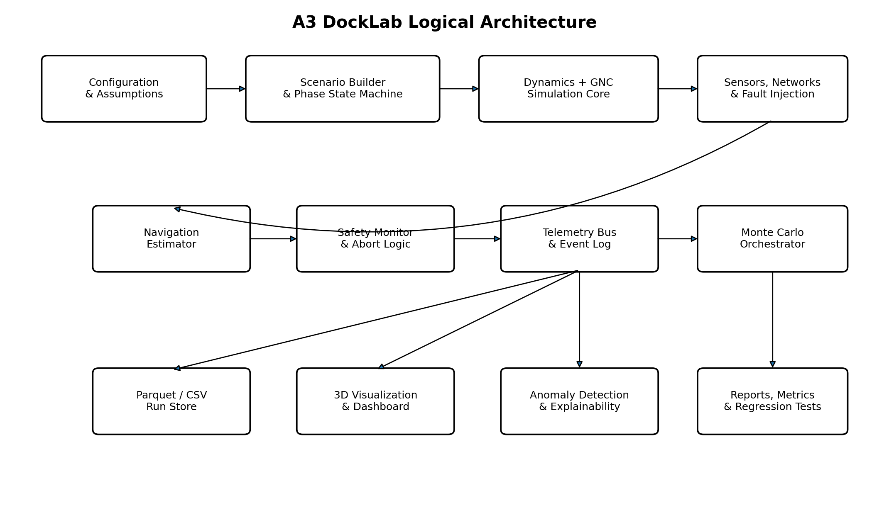
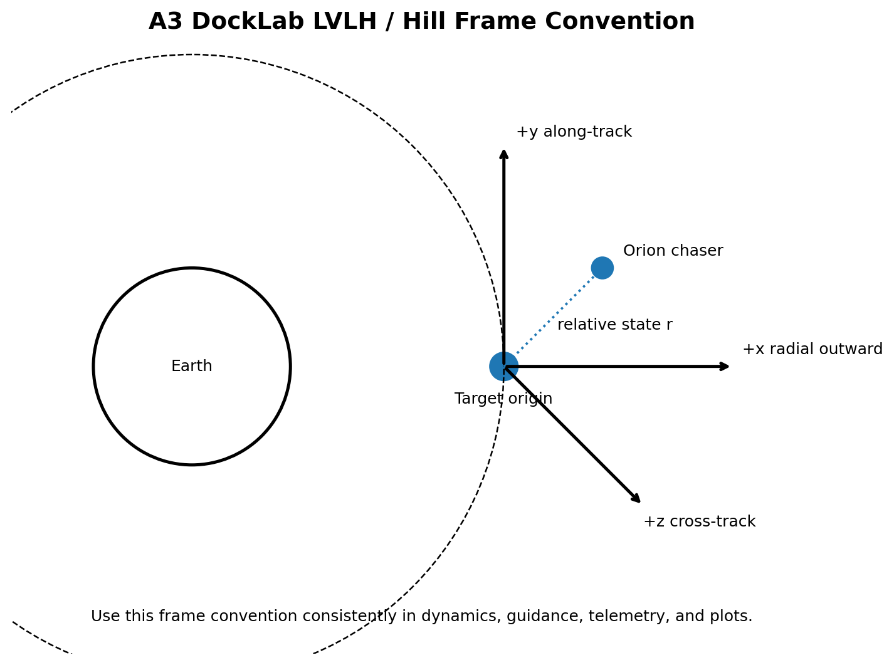

# Executive Summary

A3 DockLab is an open-source digital twin for the updated Artemis III low-Earth-orbit rendezvous-and-docking demonstration. The simulator models Orion as the active chaser spacecraft in two back-to-back scenarios:

1. **Blue Moon side docking.** Orion approaches and docks to the side-mounted docking interface of a Blue Moon Mark 2-derived test lander. After docking, Orion controls the combined vehicle.
2. **Starship nose-to-nose docking.** Orion approaches and docks nose-to-nose with a Starship Version 3-derived test article. After docking, the Starship test article controls the combined vehicle.

NASA publicly described these mission characteristics on July 15, 2026, including Orion acting as the chaser in both phases, the different docking geometries, and the change in docked-stack control authority [1]. NASA has also emphasized that Artemis III is now a 2027 Earth-orbit demonstration intended to reduce risk before later lunar landing missions [2, 3]. The public architecture remains under refinement, so A3 DockLab treats vehicle parameters and operational limits as versioned assumptions rather than pretending a press release is a flight dynamics database.

The project has four linked purposes:

- Build a credible relative-motion, attitude, controls, and docking simulation.
- Generate realistic, labeled synthetic telemetry under nominal and faulty conditions.
- Compare anomaly-detection methods from simple statistical monitors through temporal neural networks.
- Demonstrate explainable alerts suitable for mission-control decision support.

The intended result is not flight software, certification evidence, or an exact reproduction of proprietary vehicle behavior. It is an engineering research platform that makes every assumption visible, tests multiple fidelity levels, and rewards sober model comparison over decorative artificial intelligence.

# Mission Basis and Source-of-Truth Policy

## Public mission facts used by the project

As of August 4, 2026, the public Artemis III concept includes the following facts:

- Artemis III is planned as a crewed demonstration in low Earth orbit in 2027 rather than the previously described lunar landing mission [2, 3].
- Blue Origin and SpaceX plan to fly test articles derived from their future human landing systems [1].
- Orion is the chaser vehicle during docking and undocking with both test articles [1].
- Orion docks to the side of the Blue Moon test lander and nose-to-nose with the Starship test article [1].
- Orion controls the integrated vehicle during the Blue Moon docked phase; the Starship test article controls it during the second phase [1].
- The Starship test article is described as a Version 3 vehicle with a nose docking system and a public length of approximately 52 m [1].
- NASA intends to evaluate docking-system performance, communications, controllability, integrated operations, and interoperability [1, 2].

## Assumption classes

Every configurable value must carry one of three labels:

| Label | Meaning | Example |
|---|---|---|
| `public` | Directly supported by a current public primary source | Starship test article length of about 52 m |
| `derived` | Calculated from public information using documented reasoning | Approximate principal inertia from mass and cylindrical geometry |
| `placeholder` | A project value selected for sensitivity studies | Blue Moon test-article mass or Artemis-specific closing-rate limit |

The simulator must never silently convert a placeholder into an alleged NASA requirement. All run artifacts should include an assumption manifest and source revision date.

## Change management

Mission facts are stored separately from simulation defaults. A future NASA update should require changes to a mission-facts file and assumption register, not a scavenger hunt through control code. Recommended files:

- `docs/mission_facts.yaml`
- `docs/assumption_register.csv`
- `configs/vehicles/*.yaml`
- `configs/scenarios/*.yaml`

# Project Scope

## In scope

- Relative orbital motion in a circular low-Earth reference orbit.
- CW analytic propagation and targeting.
- Nonlinear inertial propagation for truth-model comparison.
- Six-degree-of-freedom rigid-body attitude dynamics.
- Translation and attitude control with saturation, deadbands, delays, and dispersions.
- Side and nose-to-nose docking geometry.
- Rendezvous phases, hold points, keep-out zones, approach corridors, and abort logic.
- Docked-stack mass properties and control-authority handoff.
- Navigation estimation and uncertainty propagation.
- Monte Carlo dispersions.
- Synthetic telemetry, channel dropouts, latency, and labeling.
- 3D mission visualization and mission-control dashboard.
- Statistical, tree-based, change-point, autoencoder, LSTM, and TCN anomaly detection.
- Alert explanations based on telemetry evidence.
- Automated unit, integration, regression, and statistical tests.

## Explicitly out of scope for the initial release

- Flight certification or human-rating evidence.
- Proprietary mass properties, thruster layouts, flight software, or docking limits.
- Detailed flexible-body, propellant-slosh, plume-impingement, or structural-load certification analysis.
- High-fidelity contact mechanics comparable to commercial multibody solvers.
- Hardware-in-the-loop or real spacecraft command generation.
- Claims that anomaly explanations are causal diagnoses.
- A photorealistic game engine before the simulator can conserve units and frames. Humanity has suffered enough dashboards that look impressive while subtracting vectors expressed in different coordinate systems.

# Users and Demonstration Value

## Primary users

- Aerospace students learning rendezvous and proximity operations.
- Controls engineers exploring docked-stack authority and controller handoff.
- Data scientists evaluating anomaly detection on physically generated telemetry.
- Solutions architects demonstrating reproducible simulation and AI workflows.
- Open-source contributors interested in astrodynamics, GNC, observability, or visualization.

## Portfolio value

A credible A3 DockLab demonstration should show more than a notebook and a loss curve. The strongest public portfolio package would include:

- A documented simulator with deterministic scenario playback.
- Side-by-side Blue Moon and Starship mission replays.
- A Monte Carlo risk envelope.
- A dashboard showing phase, uncertainty, fuel, safety margins, and alerts.
- A benchmark report comparing anomaly methods by false-alarm rate and detection delay.
- Explainability panels identifying the variables that produced each alert.
- A transparent assumption register and limitations section.

# Concept of Operations

## Scenario A: Blue Moon side docking

| Attribute | Project interpretation |
|---|---|
| Chaser | Orion |
| Target | Blue Moon Mark 2-derived test lander |
| Docking geometry | Orion nose to side-mounted lander port |
| Relative-motion controller before capture | Orion |
| Docked-stack controller | Orion |
| Important challenge | Offset docking port creates asymmetric combined mass properties and coupling |
| Crew interaction | Public concept allows up to two crew members to enter the test lander [1] |

The side docking port produces an offset between the docking interface, each vehicle center of mass, and the combined center of mass. Translation commands can therefore induce rotational moments. The combined inertia tensor is not diagonal in either original body frame unless the configuration is unusually cooperative, which spacecraft rarely are out of politeness.

## Scenario B: Starship nose-to-nose docking

| Attribute | Project interpretation |
|---|---|
| Chaser | Orion |
| Target | Starship Version 3-derived test article |
| Docking geometry | Nose-to-nose |
| Relative-motion controller before capture | Orion |
| Docked-stack controller | Starship test article |
| Important challenge | Large mass and inertia ratio plus controller handoff |
| Crew interaction | Astronauts remain in Orion under the public concept [1] |

The axial docking geometry is simpler geometrically but more demanding dynamically because the target is much larger. Orion must approach without creating unacceptable target motion, and the combined vehicle must transition to a different controller, actuator set, telemetry authority, and possibly control frame.

## Rendezvous phase state machine

A recommended state sequence is:

1. `INITIALIZATION`
2. `PHASING`
3. `FAR_FIELD_APPROACH`
4. `PROXIMITY_OPERATIONS`
5. `HOLD_POINT_1`
6. `CORRIDOR_ENTRY`
7. `HOLD_POINT_2`
8. `FINAL_APPROACH`
9. `SOFT_CAPTURE`
10. `HARD_DOCK`
11. `DOCKED_CHECKOUT`
12. `CONTROL_HANDOFF`
13. `DOCKED_MANEUVER`
14. `UNDOCK`
15. `DEPARTURE`
16. `COMPLETE` or `ABORT`

Each transition should require explicit guards. For example, final approach may require navigation covariance below a threshold, alignment inside a corridor, valid communications, acceptable closing rate, healthy thrusters, and an armed abort maneuver.

## Demonstration hold-point defaults

The starter project may use configurable demonstration values such as 1 km, 250 m, 30 m, and 10 m. These are project defaults, not Artemis III flight rules. The exact values belong in scenario configuration and must appear in run metadata.

# System Architecture

{ width=95% }

The architecture separates physical truth from observed telemetry and separates safety monitors from learned anomaly models. A neural network must not be the only component capable of noticing that the chaser is closing too fast. That arrangement would be less “artificial intelligence” and more “automated negligence.”

## Major components

### Configuration and assumptions

Validates units, ranges, source classifications, and compatibility among vehicle, orbit, docking, and fault settings.

### Scenario builder and phase state machine

Constructs the mission timeline, reference trajectories, hold points, control modes, docking frames, and controller-handoff rules.

### Dynamics and GNC simulation core

Propagates translation, attitude, mass, actuator states, docking contact, and combined-vehicle dynamics.

### Sensors, communications, and fault injection

Produces noisy delayed observations, invalid channels, biases, packet loss, and injected fault signatures.

### Navigation estimator

Maintains estimated relative state and covariance using an extended Kalman filter initially, with optional unscented or factor-graph alternatives later.

### Safety monitor

Implements deterministic limits for keep-out zones, approach corridors, closing rate, time-to-contact, uncertainty, actuator health, and predicted miss distance.

### Telemetry bus and event log

Publishes synchronized samples and discrete events to storage, dashboards, and anomaly models.

### Monte Carlo orchestrator

Runs reproducible ensembles with distributed seeds, parameter sampling, and aggregate risk metrics.

### Anomaly lab

Trains and evaluates statistical and machine-learning methods using common windows, splits, metrics, and fault labels.

# Repository Structure

```text
A3_DockLab/
├── README.md
├── LICENSE
├── CONTRIBUTING.md
├── Makefile
├── pyproject.toml
├── configs/
│   ├── scenarios/
│   │   ├── blue_moon_side.yaml
│   │   └── starship_nose.yaml
│   ├── vehicles/
│   ├── sensors/
│   ├── controllers/
│   └── faults/
├── docs/
│   ├── A3_DockLab_Project_Plan.md
│   ├── assumption_register.csv
│   ├── equations.md
│   ├── verification_plan.md
│   └── model_cards/
├── src/a3docklab/
│   ├── config.py
│   ├── cli.py
│   ├── dynamics/
│   │   ├── cw.py
│   │   ├── two_body.py
│   │   ├── perturbations.py
│   │   ├── attitude.py
│   │   └── docking_contact.py
│   ├── guidance/
│   │   ├── targeting.py
│   │   ├── profiles.py
│   │   └── aborts.py
│   ├── control/
│   │   ├── translation.py
│   │   ├── attitude.py
│   │   ├── allocation.py
│   │   └── handoff.py
│   ├── estimation/
│   │   ├── sensors.py
│   │   ├── ekf.py
│   │   └── covariance.py
│   ├── safety/
│   │   ├── rules.py
│   │   ├── geometry.py
│   │   └── monitor.py
│   ├── faults/
│   │   ├── models.py
│   │   └── injector.py
│   ├── telemetry/
│   │   ├── schema.py
│   │   ├── generator.py
│   │   └── storage.py
│   ├── anomaly/
│   │   ├── statistical.py
│   │   ├── isolation_forest.py
│   │   ├── changepoint.py
│   │   ├── autoencoder.py
│   │   ├── lstm.py
│   │   ├── tcn.py
│   │   ├── explain.py
│   │   └── evaluation.py
│   ├── simulation/
│   │   ├── engine.py
│   │   ├── phases.py
│   │   └── monte_carlo.py
│   └── visualization/
│       ├── scene3d.py
│       ├── dashboard.py
│       └── replay.py
├── notebooks/
├── tests/
│   ├── unit/
│   ├── integration/
│   ├── regression/
│   └── statistical/
├── assets/
└── .github/workflows/
```

# Coordinate Frames and Units

## SI units policy

Use SI units internally:

- Distance: meters
- Time: seconds
- Mass: kilograms
- Force: newtons
- Torque: newton-meters
- Angle: radians internally, degrees only for user-facing configuration or plots
- Angular rate: radians per second
- Propellant performance: seconds for specific impulse

Use `astropy.units` optionally at external boundaries and tests. The hot propagation loop should use validated plain arrays for performance, because wrapping every arithmetic operation in a unit object is a principled way to make a Monte Carlo run age alongside its operator.

## Frames

{ width=82% }

The baseline local-vertical/local-horizontal frame is centered on the target:

- `+x`: radial outward from Earth
- `+y`: along-track in the target direction of motion
- `+z`: cross-track, completing a right-handed frame

Additional frames:

- Earth-centered inertial frame `ECI`
- Orion body frame `B_O`
- Target body frame `B_T`
- Orion docking-port frame `D_O`
- Target docking-port frame `D_T`
- Combined-vehicle principal frame `B_C`
- Sensor frames for each camera, lidar, or relative-navigation instrument

Every vector-valued API should encode its frame in the type, variable name, or metadata. A generic variable named `position` is a small invitation to a large investigation board.

# Orbital and Relative-Motion Equations

## Circular-orbit mean motion

For reference-orbit semi-major axis $a$ and gravitational parameter $\mu$:

$$
n = \sqrt{\frac{\mu}{a^3}}
$$

For a nominal 400 km circular orbit, $a = R_E + 400\,000$ m.

## Clohessy-Wiltshire equations

For small relative separation around a circular target orbit, the linearized equations in the selected LVLH frame are:

$$
\ddot{x} - 2n\dot{y} - 3n^2x = a_x
$$

$$
\ddot{y} + 2n\dot{x} = a_y
$$

$$
\ddot{z} + n^2z = a_z
$$

where $a_x$, $a_y$, and $a_z$ are commanded or disturbance accelerations.

The unforced closed-form position solution is:

$$
x(t) = (4-3\cos nt)x_0 + \frac{\sin nt}{n}\dot{x}_0 + \frac{2(1-\cos nt)}{n}\dot{y}_0
$$

$$
y(t) = 6(\sin nt-nt)x_0 + y_0 - \frac{2(1-\cos nt)}{n}\dot{x}_0 + \frac{4\sin nt-3nt}{n}\dot{y}_0
$$

$$
z(t) = \cos(nt)z_0 + \frac{\sin(nt)}{n}\dot{z}_0
$$

The velocity solution is:

$$
\dot{x}(t) = 3n\sin(nt)x_0 + \cos(nt)\dot{x}_0 + 2\sin(nt)\dot{y}_0
$$

$$
\dot{y}(t) = -6n(1-\cos nt)x_0 - 2\sin(nt)\dot{x}_0 + (4\cos nt-3)\dot{y}_0
$$

$$
\dot{z}(t) = -n\sin(nt)z_0 + \cos(nt)\dot{z}_0
$$

These equations form a state transition matrix:

$$
\mathbf{x}(t) = \Phi(t,t_0)\mathbf{x}(t_0)
$$

with $\mathbf{x}=[x,y,z,\dot{x},\dot{y},\dot{z}]^T$.

### CW targeting

Partition the state transition matrix into position and velocity blocks:

$$
\begin{bmatrix}\mathbf{r}_f\\\mathbf{v}_f\end{bmatrix}
=
\begin{bmatrix}\Phi_{rr}&\Phi_{rv}\\\Phi_{vr}&\Phi_{vv}\end{bmatrix}
\begin{bmatrix}\mathbf{r}_0\\\mathbf{v}_0\end{bmatrix}
$$

For a specified initial position, final position, and transfer time:

$$
\mathbf{v}_0 = \Phi_{rv}^{-1}(\mathbf{r}_f-\Phi_{rr}\mathbf{r}_0)
$$

The implementation must monitor the condition number of $\Phi_{rv}$. Some transfer times are singular or nearly singular, and numerical inversion will happily provide a very precise answer to the wrong practical question.

## CW validity limits

CW is appropriate when:

- The target orbit is nearly circular.
- Relative separation is small compared with orbital radius.
- The analysis interval is not so long that neglected perturbations dominate.
- Rigid-body attitude and docking-contact effects are handled separately.

It becomes inadequate for large separations, eccentric reference orbits, long coast durations, or precision contact analysis. A3 DockLab should therefore use CW as the fast guidance and Monte Carlo model, not as the sole truth model.

## Nonlinear inertial propagation

For each spacecraft $i$:

$$
\ddot{\mathbf{r}}_i = -\mu\frac{\mathbf{r}_i}{\|\mathbf{r}_i\|^3} + \mathbf{a}_{J2,i}+\mathbf{a}_{drag,i}+\mathbf{a}_{control,i}+\mathbf{a}_{disturbance,i}
$$

The nonlinear relative state is obtained by transforming the inertial difference into the target LVLH frame:

$$
\mathbf{r}_{rel}^{LVLH}=C_{ECI\rightarrow LVLH}(\mathbf{r}_c-\mathbf{r}_t)
$$

and similarly for velocity, including frame rotation terms.

`scipy.integrate.solve_ivp` is suitable for adaptive integration and event detection [6]. Recommended methods:

- `DOP853` for high-accuracy smooth propagation.
- `RK45` for general development.
- `Radau` only when stiff contact or actuator models justify it.

## J2 perturbation

A standard Cartesian J2 acceleration model is:

$$
\mathbf{a}_{J2}=\frac{3J_2\mu R_E^2}{2r^5}
\begin{bmatrix}
x(5z^2/r^2-1)\\
y(5z^2/r^2-1)\\
z(5z^2/r^2-3)
\end{bmatrix}
$$

J2 is useful for long-duration validation but should not be used to decorate a short final-approach simulation with meaningless fidelity theater.

## Atmospheric drag

For LEO sensitivity studies:

$$
\mathbf{a}_{D}=-\frac{1}{2}\rho C_D\frac{A}{m}\|\mathbf{v}_{atm}\|\mathbf{v}_{atm}
$$

Drag uncertainty is large because area, attitude, density, and atmospheric rotation matter. It is mainly relevant to long phasing and loiter simulations.

# Attitude and Rigid-Body Dynamics

## Quaternion kinematics

Using a scalar-first quaternion $\mathbf{q}=[q_w,q_x,q_y,q_z]^T$:

$$
\dot{\mathbf{q}}=\frac{1}{2}\Omega(\boldsymbol{\omega})\mathbf{q}
$$

The implementation must renormalize carefully or use a structure-preserving update. Unchecked quaternion drift is a tiny numerical error that eventually becomes a surprisingly confident spacecraft orientation.

## Euler rotational equation

For body inertia tensor $I$, body angular velocity $\boldsymbol{\omega}$, and applied torque $\boldsymbol{\tau}$:

$$
I\dot{\boldsymbol{\omega}} + \boldsymbol{\omega}\times(I\boldsymbol{\omega})=\boldsymbol{\tau}
$$

## Attitude-error representation

For docking, use the quaternion error between desired and actual docking-port frames. The vector part of the small-angle error quaternion can feed a proportional-derivative controller:

$$
\boldsymbol{\tau}_{cmd}=-K_p\boldsymbol{\theta}_{err}-K_d\boldsymbol{\omega}_{err}+\boldsymbol{\tau}_{ff}
$$

# Guidance and Control

## Translational tracking controller

A baseline relative-position controller is:

$$
\mathbf{F}_{cmd}=m\left[-K_p(\mathbf{r}-\mathbf{r}_{ref})-K_d(\mathbf{v}-\mathbf{v}_{ref})+\mathbf{a}_{ff}\right]
$$

The feed-forward term may include CW dynamics or nonlinear gravity compensation. Gains must vary by phase. A final-approach controller should not use the same aggression as a kilometer-scale transfer unless the project goal is to test abort logic continuously.

## Line-of-sight approach profile

A reference profile can command range $\rho(t)$ with bounded velocity and acceleration. One option is a quintic polynomial:

$$
\rho(t)=a_0+a_1t+a_2t^2+a_3t^3+a_4t^4+a_5t^5
$$

with constraints on initial and final range, range rate, and acceleration.

A second option is a closing-rate schedule:

$$
0 < v_c(\rho) \leq v_{max}(\rho)
$$

where allowable closing speed decreases near contact.

## Thruster allocation

Let $\mathbf{u}$ contain individual thruster commands and $B$ map commands to body force and torque:

$$
\mathbf{w}=B\mathbf{u}, \qquad \mathbf{w}=\begin{bmatrix}\mathbf{F}\\\boldsymbol{\tau}\end{bmatrix}
$$

A constrained allocator solves:

$$
\min_{\mathbf{u}}\|B\mathbf{u}-\mathbf{w}_{cmd}\|_W^2+\lambda\|\mathbf{u}\|^2
$$

subject to minimum pulse width, maximum duty cycle, plume restrictions, failed thrusters, and command quantization.

## Propellant consumption

For total thrust magnitude $T$ and specific impulse $I_{sp}$:

$$
\dot{m}=-\frac{T}{I_{sp}g_0}
$$

For impulsive budget checks:

$$
\Delta v=I_{sp}g_0\ln\left(\frac{m_0}{m_f}\right)
$$

The simulator should integrate actual thruster-on time rather than applying the rocket equation to every tiny control sample as though all burns were ideal impulses.

# Docking Geometry and Contact

## Docking-port transforms

Each docking interface is defined by a rigid transform from vehicle body frame to docking-port frame:

$$
T_{B\rightarrow D}=\begin{bmatrix}C_{B\rightarrow D}&\mathbf{p}_{B\rightarrow D}\\0&1\end{bmatrix}
$$

Docking alignment is evaluated between `D_O` and `D_T`, not between the vehicle centers of mass.

## Capture conditions

A soft-capture event may require:

- Axial separation below `capture_distance_m`.
- Positive closing rate below the configured limit.
- Lateral offset below tolerance.
- Pitch, yaw, and roll alignment below tolerance.
- Angular rates below tolerance.
- No active abort or invalid critical navigation channel.

## Contact model

A starter compliant-contact model uses normal penetration $\delta$:

$$
F_n = \max(0,k_n\delta+c_n\dot{\delta})
$$

Tangential force can use regularized Coulomb friction:

$$
\mathbf{F}_t=-\mu F_n\tanh\left(\frac{\mathbf{v}_t}{v_\epsilon}\right)
$$

This model is acceptable for qualitative capture transients. It is not a docking-system structural model. The project should label contact-force plots accordingly.

# Combined-Vehicle Dynamics and Control Handoff

## Combined center of mass

For vehicle masses $m_1$, $m_2$ and centers $\mathbf{r}_1$, $\mathbf{r}_2$:

$$
\mathbf{r}_{CM}=\frac{m_1\mathbf{r}_1+m_2\mathbf{r}_2}{m_1+m_2}
$$

## Combined inertia

Using the parallel-axis theorem:

$$
I_C=\sum_i\left(I_i+m_i[(\mathbf{d}_i^T\mathbf{d}_i)I_3-\mathbf{d}_i\mathbf{d}_i^T]\right)
$$

where $\mathbf{d}_i$ is the offset from each vehicle center of mass to the combined center of mass, expressed in a common frame.

## Control-authority comparison

For an actuator torque magnitude $\tau$ about a principal axis:

$$
\alpha=\frac{\tau}{I}
$$

The Starship-controlled phase should visibly differ from the Orion-controlled Blue Moon phase because actuator authority, inertia, latency, deadbands, and control frames differ. Merely changing a label in the dashboard would be an ambitious interpretation of “digital twin.”

## Handoff state machine

Recommended handoff sequence:

1. Both vehicles enter `HANDOFF_PREP`.
2. State, covariance, clock, phase, and health data are exchanged.
3. Receiving controller verifies frame definitions and timestamp freshness.
4. Current controller commands a quiet hold.
5. Receiving controller enters shadow mode and computes commands without applying them.
6. Command disagreement is checked against limits.
7. Authority token transfers.
8. New controller ramps gains and actuator authority.
9. Old controller remains in monitor mode with abort authority defined by configuration.
10. Handoff is declared complete or rolled back.

Handoff faults should include stale state, frame mismatch, command discontinuity, duplicated authority, lost authority, and delayed acknowledgment.

# Navigation and Sensor Models

## Measurement equation

A generic sensor model is:

$$
\mathbf{z}_k=h(\mathbf{x}_k)+\mathbf{b}_k+\mathbf{v}_k
$$

with bias random walk:

$$
\mathbf{b}_{k+1}=\mathbf{b}_k+\boldsymbol{\eta}_k
$$

where $\mathbf{v}_k\sim\mathcal{N}(0,R)$ and $\boldsymbol{\eta}_k\sim\mathcal{N}(0,Q_b)$.

## Sensor types

- Relative range and range rate.
- Bearing angles or line-of-sight vector.
- Relative pose from docking camera or lidar.
- Inertial attitude and angular rate.
- Thruster command and valve-state telemetry.
- Propellant estimate.
- Communications timestamps and packet sequence.
- Docking contact switches and capture-latch states.

## Extended Kalman filter

Prediction:

$$
\hat{\mathbf{x}}^-_k=f(\hat{\mathbf{x}}_{k-1},\mathbf{u}_{k-1})
$$

$$
P^-_k=F_kP_{k-1}F_k^T+Q_k
$$

Update:

$$
\mathbf{y}_k=\mathbf{z}_k-h(\hat{\mathbf{x}}^-_k)
$$

$$
S_k=H_kP^-_kH_k^T+R_k
$$

$$
K_k=P^-_kH_k^TS_k^{-1}
$$

$$
\hat{\mathbf{x}}_k=\hat{\mathbf{x}}^-_k+K_k\mathbf{y}_k
$$

$$
P_k=(I-K_kH_k)P^-_k(I-K_kH_k)^T+K_kR_kK_k^T
$$

The Joseph covariance form above is preferred for numerical stability.

## Innovation consistency

Normalized innovation squared:

$$
NIS_k=\mathbf{y}_k^TS_k^{-1}\mathbf{y}_k
$$

NIS is useful both as a navigation-consistency monitor and as an anomaly feature. It should not be leaked into training if the evaluation is meant to test detection without a prebuilt statistical alarm.

# Safety Rules and Abort Logic

## Keep-out zone

An ellipsoidal keep-out zone can be represented as:

$$
\left(\frac{x}{a_x}\right)^2+\left(\frac{y}{a_y}\right)^2+\left(\frac{z}{a_z}\right)^2<1
$$

Entry is prohibited unless the vehicle is inside an authorized approach corridor and all final-approach gates are satisfied.

## Approach corridor

For a docking-axis unit vector $\hat{\mathbf{d}}$, relative position $\mathbf{r}$, and half-angle $\theta_{max}$:

$$
\cos^{-1}\left(\frac{-\mathbf{r}\cdot\hat{\mathbf{d}}}{\|\mathbf{r}\|}\right)\leq\theta_{max}
$$

A cylindrical corridor may be simpler near the port:

$$
\|\mathbf{r}_{lateral}\|\leq r_{corridor}
$$

## Closing rate

Define positive closing rate as:

$$
v_c=-\hat{\mathbf{r}}^T\mathbf{v}_{rel}
$$

A basic time-to-contact estimate is:

$$
TTC=\frac{\rho}{v_c}, \qquad v_c>0
$$

TTC is unreliable during accelerating approaches, so the safety monitor should also propagate a short predicted trajectory.

## Predicted miss distance

Under constant relative velocity:

$$
t^*=\operatorname{clip}\left(-\frac{\mathbf{r}\cdot\mathbf{v}}{\|\mathbf{v}\|^2},0,T_h\right)
$$

$$
d_{min}=\|\mathbf{r}+t^*\mathbf{v}\|
$$

A higher-fidelity monitor propagates reachable sets under bounded control and uncertainty.

## Abort triggers

Configurable triggers include:

- Keep-out zone violation.
- Corridor violation.
- Closing rate above range-dependent limit.
- Navigation covariance or NIS above limit.
- Communications age above limit.
- Thruster command/response disagreement.
- Unexpected attitude rate.
- Predicted collision or inadequate stopping distance.
- Docking alignment outside capture envelope.
- Invalid critical telemetry channels.
- Controller-handoff disagreement.

Abort types:

- `HOLD`: stop relative motion and maintain position.
- `RETREAT`: back away along the docking axis.
- `BRAKING`: cancel closing velocity.
- `PASSIVE_SAFE`: enter a trajectory designed not to collide after a failure.
- `FULL_ABORT`: execute a preplanned departure maneuver.

NASA rendezvous literature emphasizes hold points, sequencing, passive safety, and keep-out volumes [4, 5]. Project limits remain configurable and non-authoritative.

# Monte Carlo Design

## Random variables

- Initial relative position and velocity error.
- Navigation bias and white noise.
- Clock offset and timing jitter.
- Communications latency and packet loss.
- Thruster scale factor, misalignment, rise time, and minimum impulse bit.
- Vehicle mass and inertia uncertainty.
- Docking-port position and alignment uncertainty.
- Controller gain dispersions.
- Disturbance force and torque.
- Sensor dropout timing.
- Fault onset, severity, and duration.

## Sampling

Use independent draws only when independence is physically reasonable. Correlated variables should use a covariance matrix or copula. Examples:

- Thruster scale factor may correlate across thrusters from the same feed system.
- Sensor bias components may share thermal drift.
- Mass and inertia are correlated through geometry.
- Communications latency and packet loss may worsen together.

Recommended stages:

1. Latin hypercube sampling for broad parameter coverage.
2. Standard Monte Carlo for probability estimates.
3. Importance sampling around rare unsafe boundaries.
4. Worst-case optimization for adversarial but bounded conditions.

## Reproducibility

Every run stores:

- Master seed.
- Child seed per subsystem.
- Configuration hash.
- Git commit.
- Dependency lock hash.
- Assumption-register revision.
- Scenario and fault labels.

## Risk metrics

- Docking success probability.
- Abort probability.
- Keep-out zone violation probability.
- Peak closing rate.
- Minimum separation.
- Fuel distribution and percentile margins.
- Maximum alignment error.
- Controller saturation duration.
- Handoff success probability.
- Fault-detection probability and delay.

# Synthetic Telemetry

## Recommended channels

### Time and identity

- `run_id`
- `scenario_id`
- `time_ns`
- `phase`
- `controller_authority`
- `configuration_hash`

### Truth state

- Relative position and velocity in LVLH.
- Inertial states for both vehicles.
- Body attitudes and angular rates.
- Mass and propellant.
- Docking-port relative pose.

### Navigation state

- Estimated relative position and velocity.
- Estimated attitude and angular rate.
- Covariance diagonal and selected correlations.
- Innovation and normalized innovation squared.
- Sensor source and validity flags.

### Control and actuation

- Reference state.
- Commanded force and torque.
- Allocated thruster commands.
- Actual thrust and torque.
- Saturation, minimum-pulse, and fault flags.

### Safety and geometry

- Range.
- Closing rate.
- Time to contact.
- Corridor angle and lateral error.
- Keep-out zone margin.
- Predicted minimum distance.
- Abort readiness and active warnings.

### Communications

- Packet timestamp.
- Receive timestamp.
- Data age.
- Sequence gaps.
- Packet-loss estimate.
- Link state.

### Docking

- Contact state.
- Penetration estimate.
- Contact force and torque.
- Soft-capture and hard-capture state.
- Latch states.

### Labels

- Fault type.
- Fault onset and recovery.
- Fault severity.
- Affected channels.
- Ground-truth unsafe-event interval.

## Sampling rates

Suggested defaults:

| Stream | Rate |
|---|---:|
| Dynamics truth | 50 Hz |
| Control loop | 20 Hz |
| Navigation filter | 10 Hz |
| Relative pose sensor | 5-10 Hz |
| Communications status | 1-5 Hz |
| Dashboard refresh | 2-5 Hz |
| Stored ML feature stream | 10 Hz |

The telemetry generator should support multi-rate streams and preserve original timestamps. Resampling everything immediately to one table can hide latency and missing-data faults, the exact things the project claims to study.

## Storage

- CSV for small examples and transparent inspection.
- Parquet through PyArrow for production ensembles and column pruning [13].
- JSON Lines for event logs.
- Optional Zarr or xarray for dense multidimensional Monte Carlo output.

# Fault Injection Catalog

## Navigation sensor drift

Model:

$$
b(t)=b_0+rt+W(t)
$$

where $r$ is a drift rate and $W(t)$ is a random walk.

Observable effects:

- Growing innovation.
- Estimated corridor error inconsistent with truth.
- Control effort bias.
- Potential false alignment confidence.

## Thruster underperformance

Model:

$$
T_{actual}=\alpha T_{commanded}, \qquad 0\leq\alpha<1
$$

Extensions include delayed rise, intermittent response, misalignment, stuck-on, and increased minimum impulse bit.

Observable effects:

- Command/response residual.
- Persistent tracking error.
- Increased duty cycle.
- Fuel inefficiency.

## Communications latency

Model:

$$
z_{received}(t)=z_{sent}(t-\tau(t))
$$

with constant, ramping, bursty, or stochastic latency.

Observable effects:

- Increased data age.
- Phase lag between controller states.
- Handoff disagreement.
- Apparent oscillation or stale guidance.

## Attitude-control oscillation

Inject a low-damping mode, gain error, actuator delay, or sinusoidal disturbance:

$$
\tau_f(t)=A\sin(2\pi ft+\phi)
$$

Observable effects:

- Narrow-band angular-rate energy.
- Repeated thruster switching.
- Docking-port alignment excursions.

## Unexpected closing rate

Inject guidance error, target motion, or unmodeled acceleration. The fault should distinguish a true hazardous closing rate from a noisy range-rate measurement.

## Docking alignment error

Inject docking-port transform error, attitude bias, lateral translation, or structural deflection. This is especially important for Blue Moon side docking because center-of-mass alignment does not imply port alignment.

## Loss of telemetry channels

Modes:

- Constant invalid value.
- NaN or missing packet.
- Frozen last value.
- Random packet loss.
- Selective channel dropout.
- Entire sensor-bus loss.

A frozen channel is more dangerous for anomaly systems than an obvious NaN because it looks calm, and humans have historically found calm-looking wrong information quite persuasive.

# Anomaly-Detection Benchmark

## Experimental principle

All methods must receive comparable data windows, training splits, feature scaling, and fault scenarios. Hyperparameter budgets should be recorded. A deep model should not receive days of tuning while the statistical baseline is assigned one arbitrary threshold and sent to lose with dignity.

## Method 1: Statistical control limits

### Z-score monitor

$$
z_{i,t}=\frac{x_{i,t}-\mu_i}{\sigma_i}
$$

Alert when $|z_{i,t}|>k$ for a persistence interval.

### Exponentially weighted moving average

$$
s_t=\lambda x_t+(1-\lambda)s_{t-1}
$$

EWMA is effective for slow drift.

### CUSUM

$$
C_t^+=\max(0,C_{t-1}^+ + x_t-\mu-k)
$$

$$
C_t^-=\max(0,C_{t-1}^- + \mu-x_t-k)
$$

Alert when either statistic exceeds threshold $h$.

Strengths:

- Transparent.
- Easy to validate.
- Low compute.
- Direct variable attribution.

Weaknesses:

- Requires phase-aware limits.
- Struggles with multivariate interactions.
- Can produce many alerts during nominal mode transitions.

## Method 2: Isolation Forest

Isolation Forest recursively partitions feature space; unusual points tend to require shorter isolation paths. Scikit-learn provides a production implementation [9].

Recommended features:

- Tracking residuals.
- Innovations and NIS.
- Command/response differences.
- Rolling mean, variance, slope, and spectral energy.
- Closing-rate and corridor margins.
- Communications age.

Strengths:

- Strong tabular baseline.
- Works without fault labels.
- Handles nonlinear feature interactions.

Weaknesses:

- Weak temporal context unless features encode windows.
- Scores can vary by phase and scaling.
- Native explanation is limited.

## Method 3: Change-point detection

The objective for $K$ change points can be written:

$$
\min_{\tau_1,\ldots,\tau_K}\sum_{k=0}^{K}c(y_{\tau_k:\tau_{k+1}})+\beta K
$$

The `ruptures` library supports several offline segmentation methods [10, 11]. For live mission monitoring, use windowed or online approximations rather than pretending an offline algorithm that sees the future is a real-time detector.

Strengths:

- Natural for drift, step changes, and regime shifts.
- Interpretable timing.
- Useful for post-run diagnosis.

Weaknesses:

- Offline methods can leak future information.
- Mode transitions resemble anomalies.
- Multivariate cost selection matters.

## Method 4: Autoencoder

Train an encoder-decoder on nominal windows:

$$
\hat{X}=g_\theta(f_\theta(X))
$$

Anomaly score:

$$
s(X)=\frac{1}{TF}\sum_{t=1}^{T}\sum_{j=1}^{F}w_j(X_{t,j}-\hat{X}_{t,j})^2
$$

Strengths:

- Captures multivariate nominal structure.
- Channel-level reconstruction errors support explanations.
- Can use dense, convolutional, or recurrent layers.

Weaknesses:

- May reconstruct faults too well.
- Sensitive to scaling and training contamination.
- Threshold calibration is nontrivial.

## Method 5: LSTM predictor

Train an LSTM to predict the next telemetry vector or future sequence. PyTorch provides the core LSTM module [12].

$$
\hat{\mathbf{x}}_{t+1}=f_\theta(\mathbf{x}_{t-L+1:t})
$$

$$
s_t=(\mathbf{x}_{t+1}-\hat{\mathbf{x}}_{t+1})^T\Sigma^{-1}(\mathbf{x}_{t+1}-\hat{\mathbf{x}}_{t+1})
$$

Strengths:

- Learns temporal dependencies.
- Useful for latency, oscillation, and control-response faults.

Weaknesses:

- More difficult to debug.
- Training and sequence choices strongly affect results.
- Can blur fault onset due to long windows.

## Method 6: Temporal convolutional network

A TCN uses causal dilated one-dimensional convolutions. PyTorch `Conv1d` provides the core operation [12].

Strengths:

- Parallel training.
- Stable receptive field.
- Often easier to train than recurrent models.

Weaknesses:

- Receptive-field design can miss long dependencies.
- Padding and window alignment can create subtle leakage.

## Required benchmark fairness controls

- Split by simulation run, never random rows.
- Keep entire fault episodes in one split.
- Hold out parameter ranges, not merely random seeds.
- Evaluate cross-scenario transfer from Blue Moon to Starship and vice versa.
- Fit scalers on training data only.
- Include phase as a feature or train phase-specific models.
- Report compute cost and model size.
- Use identical alert persistence and cooldown rules when possible.

# Explainability and Operational Trust

## Explanation goal

The dashboard should answer:

1. What alert fired?
2. Which channels provided the strongest evidence?
3. How did those channels differ from expected behavior?
4. When did the evidence begin?
5. Which deterministic safety rules also fired?
6. What is uncertain or missing?

It should not claim “thruster valve 4 failed” merely because three correlated telemetry channels became odd. That is diagnosis theater, which is still theater even with gradients.

## Method-specific explanations

| Detector | Recommended evidence |
|---|---|
| Statistical | Threshold exceedance, standardized residual, persistence |
| Isolation Forest | Feature-dropout score change; optional SHAP marked experimental |
| Change point | Per-channel segment-cost reduction and detected transition time |
| Autoencoder | Per-channel reconstruction error and residual timeline |
| LSTM predictor | Per-channel forecast residual and integrated gradients |
| TCN predictor | Per-channel forecast residual and temporal attribution |

## Unified alert card

Each alert record should contain:

- Detector name and version.
- Score and calibrated severity.
- Detection timestamp.
- Estimated onset timestamp.
- Top contributing channels.
- Current values versus expected bands.
- Related deterministic warnings.
- Confidence and data-quality state.
- Suggested operator checks, not autonomous conclusions.

## Counterfactual check

For the top contributing feature $j$, replace its window with a nominal estimate and recompute the score:

$$
\Delta s_j=s(X)-s(X_{j\leftarrow nominal})
$$

This simple feature-dropout measure is model-agnostic and often more defensible than forcing a fashionable explanation package onto an anomaly score it was not designed to interpret.

# Evaluation Metrics

## Sample-level metrics

- Precision.
- Recall.
- F1 score.
- Area under precision-recall curve.
- False-positive rate.

These are necessary but insufficient because telemetry samples are highly correlated.

## Event-level metrics

- Fault episode detected or missed.
- Time to detection.
- Early or late warning relative to unsafe threshold.
- False alerts per simulated mission hour.
- Alert duration and chattering.
- Recovery detection delay.

## Localization metrics

- Top-1 and top-3 affected-channel accuracy.
- Mean reciprocal rank of true affected channels.
- Explanation stability under small noise perturbations.
- Agreement with known injected fault mechanism.

## Operational metrics

- CPU and memory cost.
- Model load time.
- Per-sample inference latency.
- Calibration drift by phase.
- Performance under missing channels.
- Cross-vehicle generalization.

## Recommended primary scorecard

| Metric | Why it matters |
|---|---|
| Event recall | Missing a real fault is costly |
| False alerts per hour | Operator trust collapses under alarm floods |
| Median and 95th percentile detection delay | Timing matters near docking |
| Top-3 channel localization | Measures explanation usefulness |
| Cross-scenario degradation | Tests whether the model learned physics or one scenario |
| Inference latency | Supports live dashboard use |

# Mission-Control Dashboard

## Main display

- 3D relative trajectory and vehicle geometry.
- Current rendezvous phase and controller authority.
- Range, closing rate, corridor error, and keep-out zone margin.
- Relative velocity vector.
- Fuel used and projected reserve.
- Navigation covariance ellipsoid.
- Docking alignment and angular rates.
- Communications age and channel validity.
- Deterministic warnings and anomaly alerts.

## Timeline display

Synchronized strips for:

- Range and closing rate.
- Position/velocity residuals.
- Attitude and angular rates.
- Thruster command versus response.
- NIS and covariance.
- Anomaly scores from all methods.
- Fault ground truth in replay mode only.

## Replay controls

- Play, pause, step, and speed control.
- Jump to phase or alert.
- Toggle truth versus navigation estimate.
- Toggle uncertainty ellipsoid.
- Compare nominal and faulty runs.
- Export a timestamped incident report.

## Technology choice

Plotly provides interactive 3D and time-series figures; Dash connects Plotly figures to Python callbacks and application state [7, 8]. A separate frontend is unnecessary for the first release. If the dashboard later becomes the dominant engineering effort, the project has wandered into web development wearing a flight suit.

# Library Stack

## Core simulation

| Library | Role | Notes |
|---|---|---|
| NumPy | State vectors, matrices, random sampling | Core numerical representation |
| SciPy | ODE integration, optimization, rotations, signal processing | `solve_ivp` for truth propagation [6] |
| Pydantic | Validated configuration and telemetry schemas | Reject invalid units/ranges at boundaries [14] |
| PyYAML | Human-readable scenario files | Keep schema validation in Pydantic |
| pandas | Tabular analysis and compact run output | Avoid using DataFrames inside high-rate loops |
| Astropy, optional | Units, constants, time, coordinate utilities | Best at boundaries and validation [15] |
| Numba, optional | Accelerate Monte Carlo kernels | Add only after profiling |

## Storage and messaging

| Library | Role |
|---|---|
| PyArrow | Parquet storage and efficient columnar reads [13] |
| JSON Lines | Discrete event logs |
| Optional Redis | Live telemetry buffering for multi-process deployment |

## Visualization

| Library | Role |
|---|---|
| Plotly | Interactive 3D trajectories, uncertainty, and telemetry plots [8] |
| Dash | Mission-control web application [7] |
| Matplotlib | Static verification plots and reports |

## Machine learning

| Library | Role |
|---|---|
| scikit-learn | Isolation Forest, scaling, metrics, calibration [9] |
| ruptures | Offline and windowed change-point baselines [10, 11] |
| PyTorch | Autoencoder, LSTM, and TCN models [12] |
| Captum | Integrated gradients and neural-model attribution |

## Engineering quality

| Library | Role |
|---|---|
| pytest | Unit and integration tests |
| Hypothesis | Property-based testing of frames, dynamics, and configuration |
| Ruff | Linting and formatting checks |
| mypy | Static type checking |
| pre-commit | Local quality gates |
| GitHub Actions | CI matrix and regression tests |
| MkDocs or Sphinx | Public technical documentation |

# Baseline Configuration Values

The starter repository includes illustrative values so the software runs. They are not mission data.

| Parameter | Blue Moon scenario | Starship scenario | Classification |
|---|---:|---:|---|
| Reference altitude | 400 km | 400 km | Placeholder |
| Orion mass | 26,500 kg | 26,500 kg | Placeholder |
| Target mass | 35,000 kg | 120,000 kg | Placeholder |
| Target length | 16 m | 52 m | Blue Moon placeholder; Starship public length |
| Target diameter | 7 m | 9 m | Placeholder |
| Capture distance | 0.15 m | 0.15 m | Placeholder |
| Maximum closing rate | 0.08 m/s | 0.06 m/s | Placeholder |
| Maximum lateral error | 0.10 m | 0.08 m | Placeholder |
| Maximum angular error | 2.0 deg | 1.5 deg | Placeholder |

These values should be swept rather than trusted. The sensitivity report should show which conclusions remain true across plausible ranges.

# Implementation Roadmap

The original milestone sequence has been rebaselined after completion of the project foundation, controlled CW rendezvous, multi-rate telemetry, and the first replay application. The completed baseline is retained below, followed by four forward phases ordered by engineering dependency rather than interface visibility.

## Completed baseline

The implemented baseline includes:

- Repository packaging, CI, contribution rules, source tracking, and assumption manifests.
- Validated scenario configuration with explicit SI units and LVLH frame conventions.
- Analytic CW propagation, targeting, guarded hold points, controlled proximity operations, safety monitoring, abort responses, and propellant accounting.
- Deterministic Blue Moon and Starship scenario completion.
- Versioned multi-rate truth, navigation, actuation, communications, event, and fault-label bundles.
- Local Parquet and JSON Lines storage, Phase 2 compatibility, and storage-independent replay queries.
- Plotly/Dash mission replay with time control, event jumps, fault evidence, and run comparison.

The baseline is complete when CI passes, both configured missions complete nominally, unsafe initial conditions abort deterministically, fixed seeds reproduce telemetry, and a complete run replays without loading an ensemble into browser memory. These conditions are currently satisfied.

## Forward Phase A: Physics credibility

Purpose: establish the physical validity envelope required before adding more sophisticated estimation, contact, Monte Carlo, or anomaly models.

Deliverables:

- Numerical CW propagation and analytic-versus-numerical comparison.
- ECI/LVLH state transforms with round-trip and sign-convention tests.
- Nonlinear inertial two-body truth propagation for target and chaser.
- CW-versus-two-body comparison across separation, duration, and integration tolerance.
- Reproducible validity-envelope reports with machine-readable results.
- Quaternion attitude kinematics and rigid-body rotational dynamics.
- Docking-port frame transforms and alignment metrics.
- Attitude control, force/torque allocation, combined center of mass, and full inertia tensor.
- Simplified event-based soft capture and documented momentum behavior.

Current progress: the translational validity-envelope work, quaternion
kinematics, torque-driven principal-axis rigid-body propagation, docking-port
transforms, alignment/clocking metrics, and saturated quaternion-error PD
control are implemented and tested. Port geometry is explicit in both scenario
files. Attitude and angular-rate states now propagate through controlled
rendezvous and appear in versioned telemetry. Terminal capture uses port-relative
axial, lateral, normal-alignment, and clocking guards; persistent misalignment
commands deterministic retreat. Enforcing the declared lateral limits exposed
and corrected an under-tuned reference lateral controller. Actuator geometry and
force/torque allocation are now implemented with a symmetric 24-jet engineering
layout, bounded nonnegative duty commands, per-jet health, minimum-impulse pulse
accumulation, individual on-time propellant accounting, and residual telemetry.
Combined center of mass, rotated full inertia tensors, parallel-axis translation,
principal properties, post-capture telemetry, and side-docking force/moment-arm
coupling are implemented and tested. The final core gate is also complete: a
qualitative compliant-contact law is separated from a perfectly inelastic latch
projection that conserves total linear and angular momentum and reports energy
dissipation. Phase A Physics Credibility is therefore closed. J2/drag sensitivity
and replacement of placeholders remain optional improvements, not blockers for
Forward Phase B.

Exit criteria:

- Analytic and numerical CW solutions agree within declared tolerances.
- ECI/LVLH transforms round-trip and preserve the documented frame convention.
- Two-body convergence is demonstrated under tighter solver tolerances.
- CW error is characterized by initial separation and propagation duration.
- Quaternion norm remains bounded and attitude transforms agree with rotation matrices.
- Side-docking translation/rotation coupling appears in the Blue Moon scenario.
- Contact-model limitations and momentum behavior are explicitly documented.

## Forward Phase B: Combined vehicle and handoff

Purpose: model the mission-specific change from independent vehicles to a docked stack and transfer control authority safely.

Deliverables:

- Orion-controlled Blue Moon combined stack and target-controlled Starship combined stack.
- Authority-token state machine with readiness, quiet-period, transfer, acknowledgement, and rollback states.
- State, covariance, clock, phase, and health-data exchange.
- Shadow-control comparison before transfer.
- Command-continuity monitoring and configurable discontinuity limits.
- Stale data, frame mismatch, duplicated authority, lost authority, and actuator-health handoff faults.
- Unambiguous controller-authority and command-source telemetry.

Current progress: the Phase B foundation is implemented. A single-owner
authority token now advances through readiness, quiet period, transfer pending,
acknowledgement, and active states after the capture latch. Readiness loss,
acknowledgement timeout, or excessive shadow-command discontinuity rolls back
without changing the original owner. Blue Moon completes with Orion authority;
Starship transfers authority to the target. Schema 2.0 truth telemetry records
the protocol state, unique owner, command source, target owner, readiness,
transition reason, and shadow-command delta. Schema 2.1 adds a versioned
state/covariance/clock/phase/frame/health exchange packet with strict validation.
Stale data, frame mismatch, lost acknowledgement, and unhealthy actuators produce
deterministic rollback while Orion retains authority. Schema 2.2 adds independent
Orion/target shadow stack wrenches, equivalent-force command continuity checks,
and external exactly-one-owner observations. Shadow mismatch, duplicated
authority, and lost authority produce detectable evidence followed by rollback
and recovery. Schema 2.3 completes the phase with sustained selected-owner stack
control through owner-specific actuator layouts, combined-COM force/torque
response, separate propellant attribution, and rollback after an active-owner
failure. Phase B exit criteria are satisfied; Forward Phase C is the next gate.

Exit criteria:

- No command discontinuity exceeds its configured limit.
- Rollback succeeds for stale, inconsistent, or unacknowledged handoff data.
- Exactly one controller owns authority outside explicitly modeled transition states.
- Blue Moon and Starship scenarios demonstrate their correct post-docking authority.

## Forward Phase C: Estimation, Monte Carlo, and Lakehouse

Purpose: quantify uncertainty and risk at scale using platform-independent domain contracts with Databricks adapters at the boundary.

Deliverables:

- Extended Kalman filter with covariance, innovation, and normalized-innovation telemetry.
- Remaining sensor, communication, actuator, alignment, and telemetry-loss faults.
- Reproducible random streams, parameter distributions, correlated sampling, and ensemble manifests.
- Local and distributed Monte Carlo runners with convergence and sensitivity reporting.
- Docking, abort, fuel, separation, alignment, saturation, handoff, and fault-detection risk metrics.
- Delta-backed `RunStorage` and `ReplayStore` adapters.

Current progress: the Phase C estimator foundation is implemented. A six-state
CW extended Kalman filter now replaces interpolated noisy measurements in the
navigation-estimate stream. It predicts at the configured estimator rate,
updates only when a relative-navigation measurement arrives, uses explicit
white-acceleration process covariance and Joseph-form measurement updates, and
emits per-axis uncertainty, covariance trace, six-component innovation,
normalized innovation squared, consistency threshold, and measurement-used
state. Schema 3.0 establishes these Lakehouse-facing estimator semantics.
Reproducible bounded/correlated parameter sampling, deterministic child seeds,
local ensemble execution, stable manifests, running convergence estimates, and
docking/abort/fuel/alignment/handoff risk summaries are also implemented. The
ensemble contract now also includes deterministic Bernoulli fault sampling,
fault windows, nominal-versus-faulted run labels, and estimator RMSE, normalized
innovation consistency, and covariance-growth tail metrics. Delta-backed run
storage and replay adapters now share the local query contract through an
injected catalog, with a Spark implementation for Databricks and an in-memory
contract-test implementation. Ensemble manifests also declare their execution
backend, partition count, and child-seed strategy. The next increment is the
distributed job/MLflow orchestration layer and Lakebase application state. The
Databricks bundle foundation now declares development/production targets, the
replay App, serverless simulation and Monte Carlo Jobs, an MLflow experiment,
and secret-free deployment variables. SQL-backed App replay now uses the bound
warehouse with runtime OAuth, parameterized predicates, validated identifiers,
and local filesystem fallback. Bundle-managed Lakebase application state now
covers annotations, saved views, reviewer dispositions, and saved comparisons
through an independently tested transactional repository. This completes the
planned Phase C platform boundary; workspace deployment validation remains an
environment-specific release gate. That gate is now automated: it runs a
reference simulation, verifies SQL-backed Delta replay, checks App/Lakebase
health, and performs an annotation write/read round trip. Release acceptance
requires this smoke command to pass in the target workspace.
- MLflow experiment tracking for simulation and later model-training runs.
- Lakebase-backed annotations, saved views, review state, and comparisons.

Exit criteria:

- Covariance remains symmetric positive semidefinite within tolerance.
- Innovation consistency is evaluated against expected distributions.
- Fixed seed sets reproduce run identities and aggregate statistics.
- Risk summaries converge as ensemble size grows.
- Local and Databricks adapters pass the same contract tests.
- Simulation and application domain code contain no direct Databricks dependency.

## Forward Phase D: Anomaly benchmark and operational explainability

Purpose: compare anomaly methods fairly and present evidence suitable for operator investigation without claiming causal diagnosis.

Deliverables:

- Statistical limits, EWMA, CUSUM, Isolation Forest, and change-point baselines.
- Autoencoder, LSTM predictor, and temporal convolutional network after baseline validation.
- Shared feature allowlists, windowing, scaling, splits, tuning budgets, persistence, grouping, and cooldown behavior.
- Event recall, false-alert rate, detection delay, localization, cross-scenario degradation, and inference-latency scorecards.
- Unified alert cards with detector version, threshold, onset estimate, contributing channels, evidence window, deterministic warnings, and data-quality context.
- Counterfactual feature-dropout checks, stable channel-contribution views, and exportable incident reports.
- Databricks Jobs and MLflow workflows for repeatable benchmark execution.

Exit criteria:

- No training split leaks runs, fault episodes, truth, or label fields.
- Statistical baselines are operational before neural methods are admitted.
- All methods receive comparable tuning budgets and evaluation windows.
- Results include event recall, false alerts per hour, detection delay, and localization.
- Each alert links to evidence and avoids causal language.
- Explanations remain stable under small perturbations.

## Sequencing rule

Forward phases are dependency gates. Physics Credibility precedes combined-vehicle handoff; credible dynamics and handoff precede uncertainty ensembles; and anomaly models follow validated telemetry, labels, splits, and statistical baselines. Dashboard capability may evolve incrementally, but it must not drive or redefine physical and statistical semantics.

# Verification and Validation

## Unit tests

- Mean motion against known calculation.
- CW state-transition identity at zero time.
- CW derivative against finite differences.
- Cross-track harmonic motion.
- Targeting terminal-state accuracy.
- Inertial gravity direction and magnitude.
- Quaternion normalization and composition.
- Parallel-axis inertia calculation.
- Keep-out zone and corridor geometry.
- Closing-rate sign convention.
- Thruster allocation constraints.
- Fault onset and recovery timing.

## Property-based tests

- Frame rotation matrices remain orthonormal.
- Transform followed by inverse returns original vector.
- Quaternion and rotation matrix agree.
- Zero command produces no propellant use.
- Positive thrust never increases stored propellant.
- Covariance remains symmetric positive semidefinite within numerical tolerance.
- Replaying a seed produces identical telemetry.

## Integration tests

- Full nominal Blue Moon docking.
- Full nominal Starship docking and handoff.
- Abort from each approach phase.
- Navigation drift fault detected without truth leakage.
- Thruster underperformance causes command/response residual.
- Communications latency affects data age and handoff checks.
- Channel loss preserves explicit invalidity rather than silently forward filling.

## Regression tests

Store compact “golden” results for:

- Phase transition timestamps.
- Terminal relative state.
- Fuel used.
- Minimum separation.
- Peak contact force in the simplified model.
- Alert onset and top contributing channels.

Use tolerance bands, not exact floating-point file equality across platforms.

## Statistical tests

- Monte Carlo sample mean and variance against known toy distributions.
- Confidence interval coverage.
- Detector false-positive rate on held-out nominal runs.
- Seed independence.
- Sensitivity to training contamination.

## Cross-model validation

- CW analytic versus numerically integrated CW.
- CW versus nonlinear truth for increasing range and duration.
- Simplified combined inertia versus independent calculation.
- Dashboard values versus stored telemetry.

# Known Hiccups and Technical Risks

## Public-data limitations

**Problem:** Exact mass properties, docking tolerances, thruster maps, sensor performance, and flight rules are not public.

**Mitigation:** Maintain an assumption register, expose ranges, perform sensitivity analysis, and avoid authoritative language.

## Mission architecture changes

**Problem:** Artemis planning changed materially in 2026 and may change again.

**Mitigation:** Version mission facts by source date, isolate them from code, and archive configuration used in every release.

## CW misuse

**Problem:** CW can look accurate while violating its assumptions.

**Mitigation:** Publish validity envelopes and compare against nonlinear truth automatically.

## Frame and sign errors

**Problem:** Different references use different radial/along-track conventions.

**Mitigation:** Put the frame diagram in code docs, encode frame names in variables, and test known trajectories.

## Docking geometry ambiguity

**Problem:** Public images do not provide exact port offsets or orientation matrices.

**Mitigation:** Use explicit placeholder transforms and sweep them.

## Side-docking mass-property coupling

**Problem:** Off-axis geometry creates products of inertia and control coupling.

**Mitigation:** Compute the full inertia tensor, not just three hand-entered principal moments.

## Starship scale disparity

**Problem:** A large mass and inertia ratio can create numerical and visualization problems.

**Mitigation:** Use nondimensional checks, adaptive scales, and separate camera modes. Do not exaggerate Orion until it is the size of a municipal building merely so users can find it.

## Contact stiffness

**Problem:** Stiff spring contact forces can force tiny integrator steps.

**Mitigation:** Separate contact integration, use event-based capture, or select an implicit solver only for the contact phase.

## Propellant slosh and flexible modes

**Problem:** Rigid-body dynamics omit important large-vehicle behavior.

**Mitigation:** Treat slosh/flex as injected disturbance modes in v1; add reduced-order models later.

## Plume impingement

**Problem:** Thruster geometry near a target affects safe approach directions.

**Mitigation:** Begin with prohibited thruster/geometry combinations and cone checks; do not claim thermal or contamination fidelity.

## Multi-rate time alignment

**Problem:** Resampling can erase latency and dropout signatures.

**Mitigation:** Preserve event time and receive time, use explicit interpolation policy, and test time alignment.

## Label leakage

**Problem:** Fault labels, truth states, or safety flags can accidentally enter model features.

**Mitigation:** Define feature allowlists and audit training tables.

## Phase transition false alarms

**Problem:** Nominal docking phases are strongly nonstationary.

**Mitigation:** Use phase-aware models, transition masks, or conditional thresholds.

## Synthetic-to-real gap

**Problem:** Models may learn simulator artifacts rather than spacecraft behavior.

**Mitigation:** Randomize nuisance parameters, hold out simulator regimes, compare physics residual features, and state that real-world validity is unproven.

## Explainability overclaiming

**Problem:** Feature attribution is evidence, not root cause.

**Mitigation:** Use language such as “largest contributors to the score” and include data-quality context.

## Deep-model overfitting

**Problem:** Autoencoders and temporal models can memorize scenarios.

**Mitigation:** Hold out parameter ranges and entire vehicle scenarios; report baseline comparisons and learning curves.

## Alarm flooding

**Problem:** Sample-level thresholds create hundreds of alerts per event.

**Mitigation:** Add persistence, grouping, cooldown, and event-level evaluation.

## Dashboard performance

**Problem:** Millions of Monte Carlo samples can overwhelm browser callbacks.

**Mitigation:** Pre-aggregate, decimate for display, lazy-load runs, and keep analysis in backend processes.

## Numerical reproducibility

**Problem:** Adaptive solvers and parallel random generation can vary.

**Mitigation:** Store solver settings, use explicit random streams, and compare tolerances rather than bytes.

## Licensing and branding

**Problem:** Mission and vehicle names are trademarks; public images may have usage restrictions.

**Mitigation:** Use an unaffiliated-project disclaimer, original geometry assets, source attribution, and no official logos in branding.

# Open-Source Governance

## Recommended license

MIT is simple for a portfolio and education project. Apache-2.0 is an alternative if explicit patent language is desired. The starter repository uses MIT.

## Contribution categories

- `good first issue`: tests, docs, small visualization features.
- `astrodynamics`: propagation and targeting.
- `gnc`: guidance, control, allocation, estimation.
- `safety`: constraints and abort logic.
- `telemetry`: schemas, storage, replay.
- `ml`: detectors and evaluation.
- `explainability`: alert evidence.
- `validation`: independent checks and literature comparison.

## Reproducible releases

Each release should include:

- Tagged source.
- Locked dependency file.
- Assumption register.
- Scenario bundle.
- Benchmark report.
- Known-limitations statement.
- Generated example telemetry.

# Stretch Goals

## Trajectory optimization

- Model predictive control.
- Sequential convex programming.
- Passive-safe trajectory constraints.
- Fuel-optimal multi-impulse targeting.

## Advanced navigation

- Unscented Kalman filter.
- Factor-graph smoothing.
- Vision-based relative pose with synthetic imagery.
- Sensor-fusion degradation studies.

## Advanced dynamics

- Tschauner-Hempel equations for eccentric reference orbits.
- Reduced-order propellant slosh.
- Flexible appendage modes.
- Plume keep-out geometry.
- More detailed docking mechanism.

## AI research

- Physics-informed residual models.
- Self-supervised telemetry representation learning.
- Domain adaptation between vehicle scenarios.
- Conformal anomaly thresholds.
- Causal fault-isolation graphs.
- Human-in-the-loop alert ranking.

## Deployment

- Containerized dashboard.
- Databricks-based distributed Monte Carlo and MLflow experiment tracking.
- Delta tables for telemetry and fault catalogs.
- GPU temporal-model training.
- Public hosted replay of curated runs.

# Definition of Done for Version 1.0

A3 DockLab 1.0 is complete when:

1. Both public Artemis III docking scenarios run from configuration.
2. Orion acts as chaser in both scenarios.
3. The Blue Moon stack uses Orion control after docking.
4. The Starship stack transfers control to the target after docking.
5. CW and nonlinear propagation are both available and compared.
6. Six-degree-of-freedom attitude and simplified contact are implemented.
7. Keep-out zones, corridors, closing-rate rules, and aborts are tested.
8. At least 1,000-run Monte Carlo ensembles execute reproducibly.
9. All seven requested fault classes can be injected and labeled.
10. Statistical limits, Isolation Forest, change-point detection, autoencoder, LSTM, and TCN are benchmarked.
11. Results include event recall, false alerts per hour, detection delay, and channel localization.
12. Every alert presents channel-level evidence.
13. The dashboard replays nominal and faulty missions with uncertainty and warnings.
14. Every non-public vehicle value is labeled as an assumption.
15. The documentation clearly states that the project is not flight software or an official mission model.

# Recommended First Build Slice

The most effective first public demo is smaller than the complete vision:

1. Implement CW propagation and targeting.
2. Build one phase-controlled approach to a static target in LVLH.
3. Add corridor, closing-rate, and abort rules.
4. Generate 10 Hz telemetry with range noise, navigation drift, and thruster scale error.
5. Compare statistical limits, Isolation Forest, and an autoencoder.
6. Build a Plotly/Dash replay with alert explanations.
7. Add the Starship control-handoff state machine after the first scenario is reliable.

This produces a useful project quickly while preserving a path to high fidelity. Starting with a full 6-DOF contact model, distributed training, and a cinematic 3D Earth would mostly produce three half-finished systems and a README that says “coming soon,” the traditional grave marker of ambitious repositories.

# References

[1] NASA, “How NASA’s Artemis III Lander Test Will Pave Way for Moon Landings,” July 15, 2026. https://www.nasa.gov/directorates/esdmd/artemis-campaign-development-division/human-landing-system-program/how-nasas-artemis-iii-lander-test-will-pave-way-for-moon-landings/

[2] NASA, “NASA Outlines Preliminary Artemis III Mission Plans,” May 13, 2026. https://www.nasa.gov/missions/artemis/artemis-3/nasa-outlines-preliminary-artemis-iii-mission-plans/

[3] NASA, “NASA Strengthens Artemis: Adds Mission, Refines Overall Architecture,” March 3, 2026. https://www.nasa.gov/directorates/esdmd/nasa-strengthens-artemis-adds-mission-refines-overall-architecture/

[4] C. J. Dennehy et al., “A Summary of the Rendezvous, Proximity Operations, Docking, and Undocking Lessons Learned from the Defense Advanced Research Project Agency Orbital Express Demonstration System Mission,” NASA NTRS, 2011. https://ntrs.nasa.gov/api/citations/20110011506/downloads/20110011506.pdf

[5] B. Barbour et al., “Spacecraft Passive Safety for Rendezvous and Proximity Operations,” NASA NTRS, 2023. https://ntrs.nasa.gov/api/citations/20230010521/downloads/Barbour_Bruce_AAS23_155_Conference_Finalized2.pdf

[6] SciPy documentation, `scipy.integrate.solve_ivp`. https://docs.scipy.org/doc/scipy/reference/generated/scipy.integrate.solve_ivp.html

[7] Plotly, Dash documentation and user guide. https://dash.plotly.com/

[8] Plotly Python documentation. https://plotly.com/python/

[9] scikit-learn documentation, `IsolationForest`. https://scikit-learn.org/stable/modules/generated/sklearn.ensemble.IsolationForest.html

[10] C. Truong, L. Oudre, and N. Vayatis, “ruptures: change point detection in Python,” 2018. https://arxiv.org/abs/1801.00826

[11] ruptures documentation. https://centre-borelli.github.io/ruptures-docs/

[12] PyTorch documentation, `torch.nn.LSTM` and `torch.nn.Conv1d`. https://docs.pytorch.org/docs/stable/

[13] Apache Arrow documentation, Reading and Writing Parquet. https://arrow.apache.org/docs/python/parquet.html

[14] Pydantic documentation, Models. https://docs.pydantic.dev/latest/concepts/models/

[15] Astropy documentation. https://docs.astropy.org/
