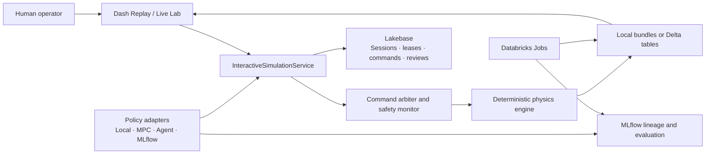

# A3 DockLab current architecture

This document is the canonical map of the implemented system. The project plan
and milestone documents explain design history and future gates; this document
describes what exists now and where it lives.

## System boundaries

The physics engine never depends on Flask, Dash, Databricks, Lakebase, Delta,
or MLflow. Platform adapters surround the deterministic core.

## Runtime paths

### Replay

`LocalReplayStore` reads portable local bundles. `DeltaReplayStore` reads the
same logical streams through a Databricks SQL warehouse. The browser receives a
decimated run once and owns playback, scrubbing, synchronized playheads, and 3D
camera state.

### Interactive Live Lab

The browser or a policy sends a `ControlIntent` through
`InteractiveSimulationService`. `CommandArbiter` checks identity, freshness,
mode, closing rate, corridor/keep-out state, and actuator limits before the
engine advances exactly one deterministic frame. Shadow policies are evaluated
through the same arbiter but never receive authority.

Local development uses the in-memory registry. In a Databricks App, the same
service binds to `ApplicationStateStore` in Lakebase. Session creation claims an
exclusive expiring lease. Every control request validates the owner, bearer
token digest, lease holder, expiry, optimistic version, and idempotency key.

### Restart recovery

Successful control operations persist a versioned JSON engine checkpoint with
the exact state and complete intent sequence. After the old lease expires, a
replacement App instance can claim a new lease, rebuild scenario and policy
configuration, replay the checkpoint, and continue from the next frame. The old
instance then fails its version/token check.

## Data ownership

| System | Owns | Does not own |
| --- | --- | --- |
| Physics engine | deterministic state, frames, events, command decisions | identity, databases, HTTP, UI |
| Lakebase | active-session ownership, leases, accepted commands, checkpoints, annotations, saved views, reviews, comparisons | high-volume telemetry |
| Delta/Lakehouse | telemetry, events, decisions, command history, run manifests, ensemble outputs | live control authority |
| MLflow | policy artifacts, versions, configuration, evaluation metrics, code lineage | control-loop scheduling |
| Databricks Jobs | offline simulation, Monte Carlo, evaluation, post-run materialization | live frame-by-frame control |
| Local bundles | portable offline telemetry/events/metadata and replay development | shared mutable state |

Delta materialization of completed interactive sessions and final MLflow lineage
are the remaining Milestone 5 platform slices.

## Application and API surface

- `GET /api/health`
- `GET|POST /api/annotations`
- `GET /api/simulations/scenarios`
- `GET /api/simulations/policies`
- `POST /api/simulations`
- `GET /api/simulations/{session_id}`
- `POST /api/simulations/{session_id}/control`
- `POST /api/simulations/{session_id}/restore`
- `GET /api/simulations/{session_id}/commands`
- `GET /api/simulations/{session_id}/policy-evaluations`

Durable control requests require Databricks-provided operator identity, a bearer
lease token, and an `Idempotency-Key` header.

## Repository map

| Path | Responsibility |
| --- | --- |
| `src/a3docklab/simulation/` | deterministic session engine, phases, commands, policies, checkpoint contract |
| `src/a3docklab/dynamics/` | orbital, attitude, vehicle-stack, and contact dynamics |
| `src/a3docklab/control/` | translation, attitude, allocation, and handoff logic |
| `src/a3docklab/safety/` | corridor, keep-out, capture, and abort monitoring |
| `src/a3docklab/application/` | HTTP API, live-session orchestration, Lakebase state |
| `src/a3docklab/visualization/` | Dash pages, replay adapters, client-side Live Lab |
| `src/a3docklab/platform/` | Delta, Databricks SQL, MLflow, and platform adapters |
| `configs/` | scenarios, telemetry, fault, Monte Carlo, and platform configuration |
| `resources/`, `databricks.yml` | Databricks Asset Bundle resources and targets |
| `tests/` | unit, contract, integration, deterministic-replay, and application tests |

## Databricks deployment

The repository is a Databricks Asset Bundle. It provisions/binds the App,
Lakebase database, SQL warehouse access, simulation and Monte Carlo Jobs, MLflow
experiment, and dev/prod targets. The App uses runtime OAuth for Databricks SQL
and Lakebase credentials. The local bundle and in-memory paths remain supported
for offline development.

See `docs/databricks_bundle.md` for deployment steps and
`docs/databricks_integration.md` for platform boundaries. The workspace smoke
job verifies Job execution, Delta replay, App health, and a Lakebase annotation
round trip.

## Documentation index

| Document | Purpose |
| --- | --- |
| `A3_DockLab_Project_Plan.md` | original master design, equations, risks, and phased plan |
| `interactive_docklab_milestones.md` | current interactive-product milestones and acceptance gates |
| `milestone_2_command_contract.md` | human/model command and safety contract |
| `milestone_3_live_lab.md` | interactive Live Lab runtime and UI |
| `milestone_4_policy_interface.md` | active/shadow policy adapters and provenance |
| `milestone_5_control_plane.md` | durable Databricks session-control implementation |
| `physics_credibility.md` | model validity, assumptions, and interpretation limits |
| `phase_b_handoff.md` | controller handoff and rollback behavior |
| `phase_c_estimation.md` | EKF architecture and diagnostics |
| `phase_c_monte_carlo.md` | risk ensemble design and outputs |
| `verification_plan.md` | verification strategy and acceptance evidence |

Machine-readable contracts are under `docs/contracts/`; assumption provenance is
in `docs/assumption_register.csv` and `docs/mission_facts.yaml`.
